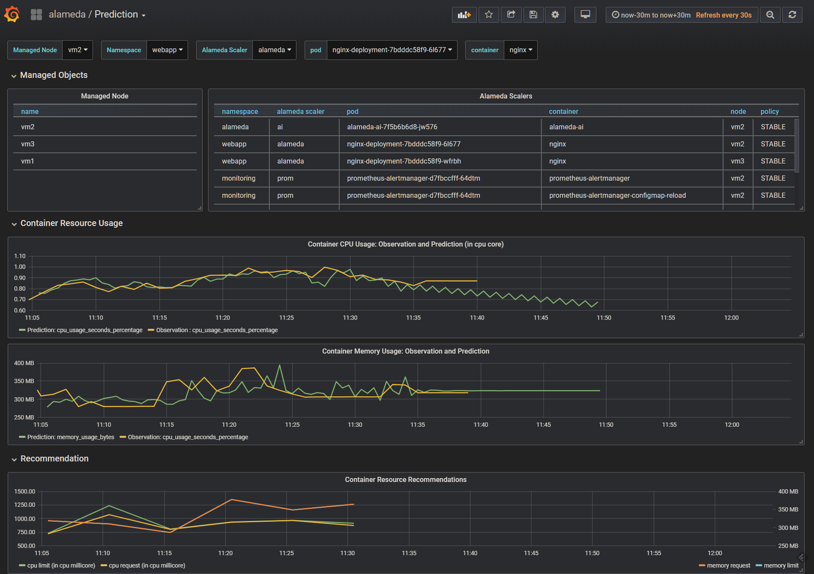

# QuickStart

This document help you get started to use Alameda. If you do not have Alameda deployed in your environment yet, please reference [deployment](./deploy.md) guide first.

## Using Alameda

To have Alameda resource usage recommendations for you, first thing is to tell Alameda what are the target containers and the policies. Then you can see the recommendations by checking the *alamedarecommendation* CRs. Alameda project also provides grafana dashboards to visualize these information.

### Specify a target object
Users can create a custom resource of *AlamedaScaler* custom resource definition (CRD) to instruct Alameda that:
1. which *deployment* object to watch, and
2. what policy that Alameda should use to give recommendations.

Currently Alameda watches containers that are deployed by *deployment* Kubernetes API object and provides *stable* and *compact* policies. The following is an example to instruct Alameda to watch deployment object(s) at *webapp* namespace with *nginx* label and give recommendations with *stable* policy. Alameda will start to give resource usage recommendations for container(s) that are created by those deployment object(s).
```
apiVersion: autoscaling.containers.ai/v1alpha1
kind: AlamedaScaler
metadata:
  name: example1
  namespace: webapp
spec:
  policy: stable
  enable: true
  selector:
    matchLabels:
      app: nginx
```

You can list all the *AlamedaScaler* CRs by:
```
$ kubectl get alamedascalers -n <your namespace>
```
and see the details by adding `-o yaml` flag.

> **Note**: an *AlamedaScaler* CR can only select deployment objects in the same namespace.

### Retrieve Alameda recommendations

Alameda outputs recommendations in a global planning manner for all the containers watched by Alameda.
They are presented as *alamedarecommendation* CRD.
You can check Alameda recommendation results by:
```
$ kubectl get alamedarecommendation -n <your namespace>
```
and see the details by adding `-o yaml` flag.

### Visualize Alameda recommendations

If Grafana services and Alameda dashboards are deployed, you can visualize Alameda workload predictions and recommendations through the provided dashboards.

## Example

The following is an example of the Alameda workflow.

- First we need a target application such as nginx by:
    ```
    $ cd <alameda>/example/samples/nginx
    $ kubectl create -f nginx_deployment.yaml
    ```
- Then we request Alameda to recommend resource usage for nginx by:
    ```
    $ cd <alameda>/example/samples/nginx
    $ kubectl create -f alamedascaler.yaml
    ```

You can check that Alameda is watching containers running in the nginx application by:
```
$ kubectl get alamedascaler --all-namespaces
NAMESPACE   NAME      AGE
webapp      alameda   5h
$ kubectl get alamedascaler alameda -n webapp -o yaml
apiVersion: v1
items:
- apiVersion: autoscaling.containers.ai/v1alpha1
  kind: AlamedaScaler
  metadata:
    annotations:
      kubectl.kubernetes.io/last-applied-configuration: |
        {"apiVersion":"autoscaling.containers.ai/v1alpha1","kind":"AlamedaScaler","metadata":{"annotations":{},"name":"alameda","namespace":"webapp"},"spec":{"enable":true,"policy":"stable","selector":{"matchLabels":{"app":"nginx"}}}}
    creationTimestamp: "2019-02-15T10:51:29Z"
    generation: 3
    name: alameda
    namespace: webapp
    resourceVersion: "2158849"
    selfLink: /apis/autoscaling.containers.ai/v1alpha1/namespaces/webapp/alamedascalers/alameda
    uid: a60c4c47-310f-11e9-accd-000c29b48f2a
  spec:
    enable: true
    policy: stable
    selector:
      matchLabels:
        app: nginx
  status:
    alamedaController:
      deployments:
        webapp/nginx-deployment:
          name: nginx-deployment
          namespace: webapp
          pods:
            webapp/nginx-deployment-7bdddc58f9-6l677:
              containers:
              - name: nginx
                resources: {}
              name: nginx-deployment-7bdddc58f9-6l677
              uid: 960374db-310f-11e9-accd-000c29b48f2a
            webapp/nginx-deployment-7bdddc58f9-wfrbh:
              containers:
              - name: nginx
                resources: {}
              name: nginx-deployment-7bdddc58f9-wfrbh
              uid: 9602a059-310f-11e9-accd-000c29b48f2a
          uid: 95fd011b-310f-11e9-accd-000c29b48f2a
kind: List
metadata:
  resourceVersion: ""
  selfLink: ""
```
And the resource usage recommendations are:
```
$ kubectl get alamedarecommendation alameda -n webapp -o yaml
apiVersion: v1
items:
- apiVersion: autoscaling.containers.ai/v1alpha1
  kind: AlamedaRecommendation
  metadata:
    creationTimestamp: "2019-02-15T10:51:29Z"
    generation: 13
    labels:
      alamedascaler: alameda.webapp
    name: nginx-deployment-7bdddc58f9-6l677
    namespace: webapp
    ownerReferences:
    - apiVersion: autoscaling.containers.ai/v1alpha1
      blockOwnerDeletion: true
      controller: true
      kind: AlamedaScaler
      name: alameda
      uid: a60c4c47-310f-11e9-accd-000c29b48f2a
    resourceVersion: "2482218"
    selfLink: /apis/autoscaling.containers.ai/v1alpha1/namespaces/webapp/alamedarecommendations/nginx-deployment-7bdddc58f9-6l677
    uid: a60f32f8-310f-11e9-accd-000c29b48f2a
  spec:
    containers:
    - name: nginx
      resources:
        limits:
          cpu: "0"
          memory: 9636Ki
        requests:
          cpu: "0"
          memory: 9636Ki
  status: {}
- apiVersion: autoscaling.containers.ai/v1alpha1
  kind: AlamedaRecommendation
  metadata:
    creationTimestamp: "2019-02-15T10:51:29Z"
    generation: 14
    labels:
      alamedascaler: alameda.webapp
    name: nginx-deployment-7bdddc58f9-wfrbh
    namespace: webapp
    ownerReferences:
    - apiVersion: autoscaling.containers.ai/v1alpha1
      blockOwnerDeletion: true
      controller: true
      kind: AlamedaScaler
      name: alameda
      uid: a60c4c47-310f-11e9-accd-000c29b48f2a
    resourceVersion: "2482651"
    selfLink: /apis/autoscaling.containers.ai/v1alpha1/namespaces/webapp/alamedarecommendations/nginx-deployment-7bdddc58f9-wfrbh
    uid: a61017e6-310f-11e9-accd-000c29b48f2a
  spec:
    containers:
    - name: nginx
      resources:
        limits:
          cpu: "0"
          memory: 9384Ki
        requests:
          cpu: "0"
          memory: 9384Ki
  status: {}
kind: List
metadata:
  resourceVersion: ""
  selfLink: ""
```
By checking the Grafana dashboards, we can visualize the resource recommendations.


